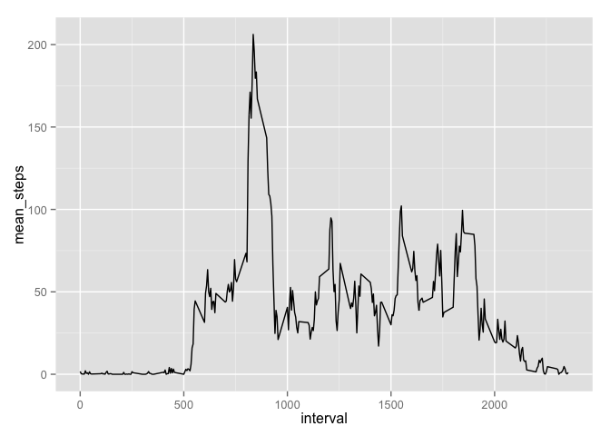

# Reproducible Research: Peer Assessment 1


## Loading and preprocessing the data
The subsequent analysis will involve the data aggregated by day and also, 
separately, by interval, so after 
loading the data, let's do the aggregations. We have to be careful to omit the 
NA data in order to do subsequent steps. Also, converting the date column to 
type Date ensures that we can do a nice time series plot later.

```r
library(dplyr)
```


```r
df <- read.csv("activity.csv")
#df <- mutate(df, date=as.Date(date, format="%Y-%m-%d"));
dfclean <- df %>% na.omit %>% mutate(date=as.Date(date, format="%Y-%m-%d"))
daily <- dfclean %>% group_by(date)
byInterval <- dfclean %>% group_by(interval)
#daily <- group_by(df, df$date)
```


## What is mean total number of steps taken per day?
Let's first plot the histogram of daily total steps.

```r
library(ggplot2)
```


```r
totals <- daily %>% summarize(total_steps=sum(steps))
qplot(total_steps, data=totals, main="Histogram of daily total steps");
```

```
## stat_bin: binwidth defaulted to range/30. Use 'binwidth = x' to adjust this.
```

 
Measuring by eye, it appears that this person would most often take between
10,000 and 15,000 steps in a day, since those are the value that contain most
of the histogram.


Next, let's find the mean and median of the total number of daily steps. Let's 
see what the average daily total is for this person.

```r
mean(totals$total_steps)
```

```
## [1] 10766.19
```

```r
median(totals$total_steps)
```

```
## [1] 10765
```
This correspondes with my original estimate above evaluating the histogram by 
eye. That the mean and median are very close means that the distribution is not
very skewed, which also matches the histogram above.

## What is the average daily activity pattern?
The following R code and plot shows the average number of steps in each time
interval, taken across all days. This reveals that there is a peak of activity
somewhere between the 750th and 1000th minute.

```r
totInts <- byInterval %>% summarize(mean_steps=mean(steps))
qplot(data=totInts, interval, y=mean_steps, geom="line")
```

 

The 5-minute interval that, on average across all the days in the dataset,
contains the maximum number of steps can be found more exactly:

```r
totInts$interval[which.max(totInts$mean_steps)]
```

```
## [1] 835
```

## Imputing missing values
Next let's check on what kind of impact the NAs are having on our results.
The total number of NAs is calculated below, for each variable in the original
data set.

```r
sum(is.na(df$steps))
```

```
## [1] 2304
```

```r
sum(is.na(df$date))
```

```
## [1] 0
```

```r
sum(is.na(df$interval))
```

```
## [1] 0
```
So it appears that only the steps variable has missing values, and a large
number of them.

One way to remove the NAs is by replacing each one with the average in its
interval. This would be a good method if this person were very consistent in 
his/her daily activities across all days. Let's do that below.

I use 'match' to produce the indices in the mean_steps that have the same interval
as in df[naInds,]. Then I use those indices to replace the NAs with the mean_step
for that interval.

```r
totInts$intSteps <- sapply(totInts$mean_steps, round)
naInds <- is.na(df$steps)

intInds <- match(df[naInds,]$interval, totInts$interval)
dfReplace <- df %>% mutate(filled_steps=steps)
dfReplace$filled_steps[naInds] = totInts$interval[intInds]
sum(is.na(dfReplace$filled_steps))
```

```
## [1] 0
```

Having filled in the NAs with averages, now let's aggregate by date, then plot
the daily totals.

```r
dfReplace <- dfReplace %>% mutate(date=as.Date(date, format="%Y-%m-%d")) 
dailyReplace <- dfReplace %>% group_by(date)
totalsReplace <- dailyReplace %>% summarize(total_steps=sum(filled_steps))
qplot(total_steps, data=totalsReplace, main="Histogram of daily total steps, 
      with NA steps replaced by interval averages");
```

```
## stat_bin: binwidth defaulted to range/30. Use 'binwidth = x' to adjust this.
```

 

Next, let's find the mean and median of the total number of daily steps. Let's 
see what the average daily total is for this person.

```r
mean(totalsReplace$total_steps)
```

```
## [1] 53828.98
```

```r
median(totalsReplace$total_steps)
```

```
## [1] 11458
```

## Are there differences in activity patterns between weekdays and weekends?


```r
day = weekdays(dfReplace$date)
dfReplace <- mutate(dfReplace, day=as.factor(ifelse((day=="Saturday") | 
                                                     (day=="Sunday"), "Weekend",
                                                 "Weekday")))
repByInterval <- dfReplace %>% group_by(day, interval)
repTotInts <- repByInterval %>% summarize(mean_steps=mean(filled_steps))
qplot(data=repTotInts, interval, y=mean_steps, geom="line", facets=day~.)
```

 
